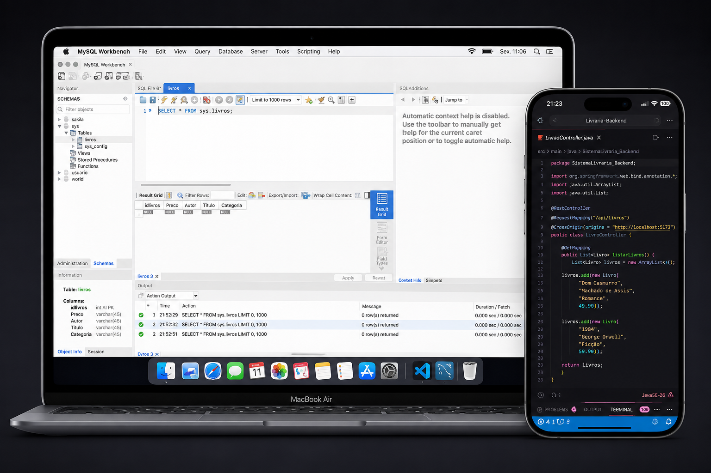

# Sistema Livraria - Backend

Backend de um sistema de livraria desenvolvido em **Java com Spring Boot**, responsável pelo gerenciamento completo do catálogo de livros por meio de uma **API RESTful**, permitindo integração eficiente com aplicações frontend desenvolvidas em React.

Durante o desenvolvimento deste projeto, foram aplicados conceitos fundamentais de desenvolvimento backend, incluindo a criação de endpoints REST, arquitetura em camadas (Controller, Service e Repository), manipulação de requisições HTTP, serialização de dados em JSON e implementação de boas práticas de organização de código.

Além disso, foram utilizados recursos do **MySQL** para modelagem e gerenciamento do banco de dados, abrangendo criação de tabelas, relacionamentos, consultas SQL, persistência de dados e integração com a aplicação através do **Spring Data JPA** e **Hibernate**.

### Principais tecnologias utilizadas

* Java
* Spring Boot
* Spring Data JPA
* Hibernate
* MySQL
* Maven
* API REST
* JSON
* Git e GitHub

### Competências desenvolvidas

* Desenvolvimento de APIs RESTful
* Integração entre frontend e backend
* Persistência de dados com JPA/Hibernate
* Modelagem e gerenciamento de banco de dados MySQL
* Operações CRUD (Create, Read, Update e Delete)
* Configuração de CORS para comunicação entre aplicações
* Tratamento de requisições e respostas HTTP
* Organização de projetos seguindo boas práticas de arquitetura de software
* Versionamento de código com Git e GitHub

Este projeto demonstra a aplicação prática de conceitos modernos de desenvolvimento backend, proporcionando uma base sólida para sistemas web escaláveis, seguros e integrados a aplicações frontend modernas.
